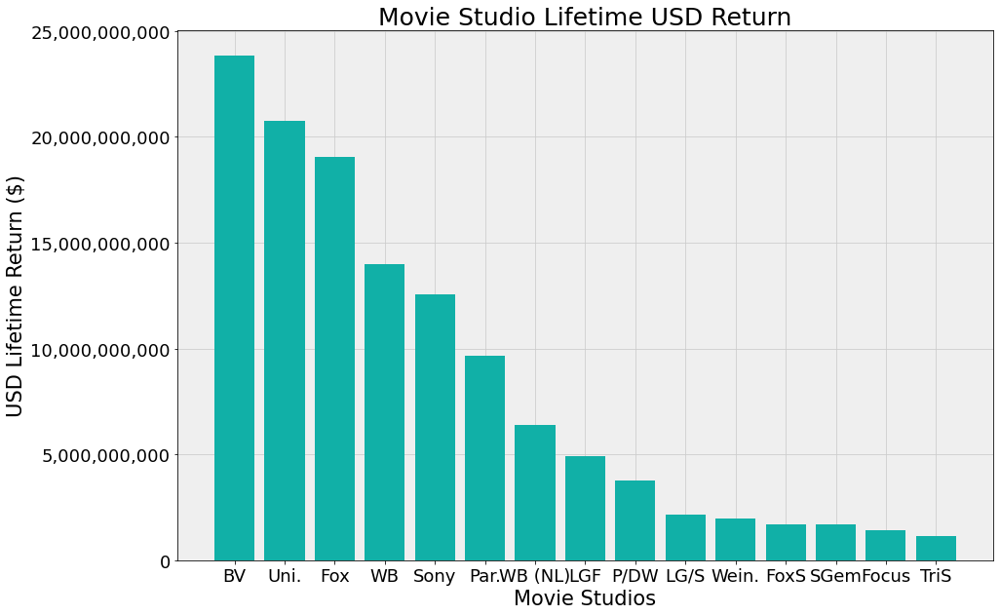
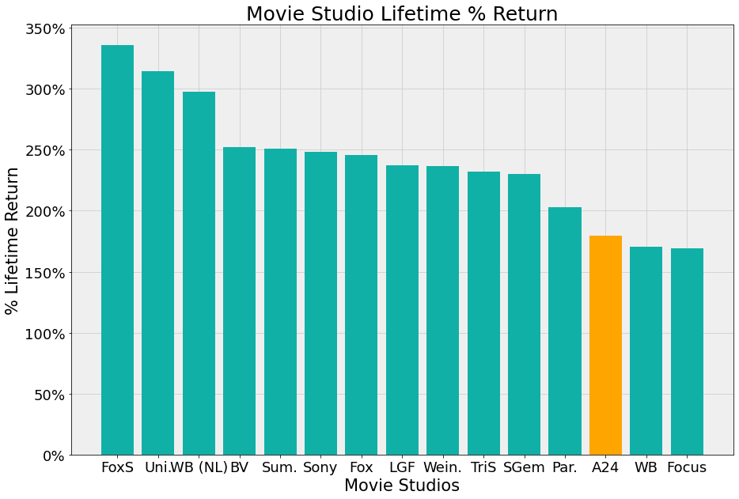

# Microsoft Movie Studio Analysis & Recommendations

**Authors**: [Kevin Atkinson](kmatk620@gmail.com), [Vlad Sekiguchi](vladiseki@yahoo.com)

## Overview

This project analyzes the movie data from [IMDb](https://www.imdb.com/), [Rotten Tomatoes](https://www.rottentomatoes.com/) (RT), and [Box Office Mojo](https://www.boxofficemojo.com/) (BOM) in order to recommend a course of action with respect to initial projects that Microsoft Movie Studios (MMS) should proceed with. 

## Business Problem
This endeavor will require a substantial initial investment. It's important to make a major impact quickly, in order to establish MMS with a reputation as a place where quality films are made.

## Data
We analyzed data from IMDb, Rotten Tomatoes, and Box Office Mojo. We limited our scope to look only at original movies made within the past 20 years. 

## Methods
We used conventional data analysis tools in order to establish a relationship between past successes and extrapolate those to future projects. These include cast and crew, genres, and potential acquistion targets. 

## Results
High number of votes is strongly correlated with a high average rating.


Ratio of Fresh to Rotten from Rotten Tomatoes indicates Dramas are viewed most positively.


Depiction of most successful studios in gross dollar volume.


Depiction of most successful studios in percentage return.



## Recommendations
Our analysis has led us to three primary recommendations for MMS to follow as a course of action going forward:
- **Hire Actors, Actresses, Directors, and Producers with a strong, established reputation.** Actors and Actresses such as Leonardo DiCaprio and Jennifer Lawrence, and Directors and Producers such as Christopher Nolan and Emma Thomas, all have strong established track records of fantastic work. Their inclusion in our upcoming projects will draw valuable eyes and media attention, increasing our reputation as a result.
- **Make Dramas and Drama Variants** Dramas are far and away the most popular genres of films. Comedy Dramas, 
- **Consider acquiring studios such as A24** Acquiring A24 will jumpstart production, they already have a great catalogue of movies and deep seeded relationships in the industry.

## Next Steps
Determining market viability for current Intellectual Property in company catalog already. Particularly both those in house and in Activison/Blizzard acquistion. As an example, a few are: Halo, Call of Duty, World of Warcraft, Fallout. Combining well-known actors with a popular genre and a well-run studio with deep industry experience will draw attention and critical acclaim.

## For More Information
See the full analysis in the [Jupyter Notebook](https://github.com/kmatk/Movie_Studio_P1_Project/blob/main/Movie_Studio_Recommendations.ipynb) or review this [presentation](https://github.com/kmatk/Movie_Studio_P1_Project/blob/main/Microsoft_Studios_Presentation.pdf)

For additional info, contact [Kevin Atkinson](mailto:kmatk620@gmail.com), [Vlad Sekiguchi](mailto:vladiseki@yahoo.com) 

## Repository Structure

```
├── code
│   ├── Budgets_EDA.ipynb
│   ├── imdb_db_EDA.ipynb
│   ├── VS Data Cleaning.ipynb
│   └── JN Rough Draft template_vs.ipynb
├── data
├── images
├── README.md
├── Microsoft_Studios_Presentation.pdf
└── Microsoft_Studio_Recommendations.ipynb
```